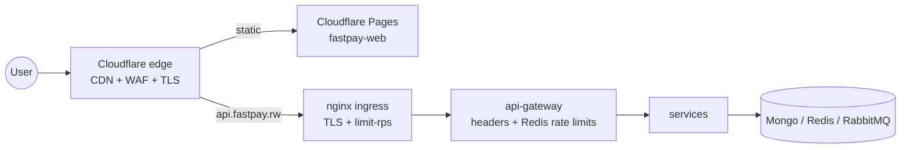

# Network Security & CDN

How FastPay traffic is protected from the edge down to the pod network.



## 1. Web CDN — Cloudflare Pages (`fastpay-web`)

Config lives in the repo:

| File | Purpose |
|------|---------|
| `fastpay-web/public/_headers` | Edge security headers (CSP, HSTS, nosniff, frame deny) + immutable caching for `/assets/*` |
| `fastpay-web/public/_redirects` | SPA fallback (`/* → /index.html 200`) |
| `fastpay-web/wrangler.toml` | Pages project config |

Deploy:

```bash
cd fastpay-web
npm run build
npx wrangler login          # once
npx wrangler pages deploy dist --project-name fastpay-web
```

Set the API base for production builds: `VITE_API_URL=https://api.fastpay.rw`
(Pages → Settings → Environment variables).

Update the `connect-src` in `_headers` if the API domain changes.

## 2. API edge — Cloudflare in front of the gateway

Done in the Cloudflare dashboard (not in-repo):

1. Add DNS record `api.fastpay.rw` → your cluster's public IP, **proxied** (orange cloud).
2. SSL/TLS mode: **Full (strict)** — origin has a real cert via cert-manager.
3. WAF: enable managed ruleset + a rate-limiting rule (e.g. 100 req/10s per IP on `/auth/*`).
4. Optional: Turnstile on signup to stop bot registrations.

Cloudflare has a Kigali PoP, so RW users get local TLS termination and caching.

## 3. TLS on the ingress (cert-manager)

Production overlay: `fastpay-backend/infrastructure/k8s/overlays/production/`

```bash
# one-time on the production cluster
./infrastructure/k8s/scripts/setup-cert-manager.ps1   # or .sh

# deploy with TLS + HTTPS redirect + edge rate limits
kubectl apply -k infrastructure/k8s/overlays/production
```

- `production/cert-manager-issuers.yaml` — `letsencrypt-staging` and `letsencrypt-prod` ClusterIssuers (HTTP-01 via nginx).
- `overlays/production/ingress-tls.yaml` — `api.fastpay.rw` with `tls:` block, `force-ssl-redirect`, and nginx `limit-rps: 20` / `limit-connections: 30`.
- Test with the staging issuer first (swap the `cert-manager.io/cluster-issuer` annotation) to avoid Let's Encrypt rate limits.

The local overlay (`overlays/local`) stays HTTP on `api.fastpay.local` — no ACME possible for local hosts.

## 4. Pod network segmentation (NetworkPolicies)

`fastpay-backend/infrastructure/k8s/base/networking/network-policies.yaml` (applied with the base kustomization):

| Policy | Effect |
|--------|--------|
| `default-deny-ingress` | No pod accepts traffic unless another policy allows it |
| `allow-intra-namespace` | fastpay pods can talk to each other (gateway → services, services → data) |
| `allow-ingress-to-gateway` | Only the `ingress-nginx` namespace can reach `api-gateway:3000` |
| `mongo/redis/rabbitmq-from-services-only` | Datastores explicitly scoped to fastpay pods |

Net effect: from outside the namespace, **only the gateway via nginx** is reachable.
Egress is left open (services need DNS, Horizon, OpenAI, MoMo APIs).

Note: NetworkPolicies need a CNI that enforces them (Calico/Cilium — standard on
EKS/GKE/AKS). Docker Desktop's default CNI ignores them silently.

## 5. Application rate limiting (gateway)

`apps/api-gateway/src/middleware/security.middleware.ts`:

- **Redis-backed** fixed-window limiter (`INCR` + `PEXPIRE`, keys `rl:<prefix>:<ip>`)
  when `REDIS_HOST` is set — shared across replicas, survives restarts.
- **Fails open** to per-process in-memory buckets if Redis is down, and flips back
  automatically when Redis recovers.
- Rules: `/auth/login` 20/15min · `/offline/relay` 30/min · `/security` 120/min.
- Security headers + HSTS (production) + `X-Request-Id` tracing unchanged.

## Defense-in-depth summary

| Layer | Control |
|-------|---------|
| Edge | Cloudflare CDN, WAF, DDoS, TLS 1.3, edge rate limits |
| Ingress | nginx TLS (Let's Encrypt), forced HTTPS, `limit-rps` |
| Gateway | Security headers, CSP, HSTS, CORS allowlist, Redis rate limits, request IDs |
| Cluster | Default-deny NetworkPolicies, gateway-only entry, non-root pods, seccomp, read-only rootfs |
| Database | MongoDB SCRAM + TLS, Secrets-backed URIs, RBAC users, daily backups — see [mongo.md](./mongo.md) |
| Supply chain | gitleaks in CI, image scanning |
