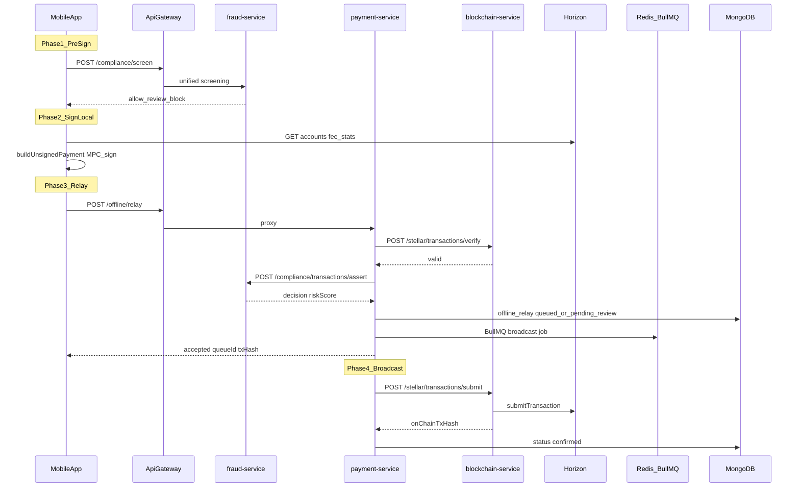

# STRIDE Threat Model — Stellar Offline-Relay Payment Flow

Scope: FastPay wallet-to-wallet payments via signed XDR relay (`prepareOfflinePayment` → `POST /offline/relay` → verify → fraud assert → broadcast).

Out of scope this phase: MoMo (`/momo/*`), bank-pay (client-only mock).

## Sequence

## QR receive bypass

The receive path (`offline/receive.tsx`) relays a scanned signed XDR **without** client pre-screening. Server-side `transactions/assert` is the mandatory gate.

## STRIDE matrix

| STRIDE | Asset / boundary | Threat | Current control | Mitigation (this rollout) |
|--------|------------------|--------|-----------------|---------------------------|
| **S** | Refresh JWT, device Ed25519 key | Token theft, session hijack | Secure storage, single refresh hash | Multi-session registry, revoke-all, trusted device metadata |
| **S** | Biometric challenge nonce | Challenge replay | Redis TTL | One-time consumption (`consumeChallenge` deletes key) |
| **T** | Signed XDR in QR payload | Tampered amount/destination | Server re-parses + signature verify | QR `v:2` integrity hash; reject unknown versions |
| **R** | `offline_relay` queue | Replay identical signed XDR | `txHash = sha256(xdr)` unique index | Rules engine `duplicate_xdr` block + Redis idempotency TTL |
| **I** | Compliance API error bodies | Leak screening rule names | 403 with detail | Client normalizes to generic user message |
| **D** | `POST /offline/relay` | Relay queue flood | None at gateway | Per-IP + per-route rate limits; BullMQ backpressure |
| **D** | `POST /auth/login` | Credential stuffing | Redis login rate limit | Gateway rate limit layer |
| **E** | Audit logs | Under-reporting fraud events | Partial auth audit | `payment.fraud.*` events with severity taxonomy |
| **E** | Fraud rules config | Operator misconfiguration | N/A | Rule hits stored on `FraudCase`; dry-run via env |
| **T** | Mobile → Horizon HTTP | MITM on account data | Direct Horizon URL | Cert pinning stub + documented rotation |
| **T** | API Gateway TLS | MITM on relay | HTTPS in prod | HSTS, security headers at gateway |

## Trust boundaries

1. **Device** — MPC/key material, transaction PIN (local only)
2. **Gateway** — TLS termination, rate limits, request ID
3. **payment-service** — signature verify + fraud gate before queue
4. **fraud-service** — rules engine + Chainalysis mock provider
5. **blockchain-service** — cryptographic verify/submit
6. **audit-service** — read-only Security Center APIs (JWT guarded)

## Residual risks

- Mock Chainalysis does not detect real-world sanctions (provider adapter ready for swap-in).
- Horizon MITM until cert pinning is enforced in production builds.
- `pending_review` txs require ops approval workflow (schema + status added; admin UI out of scope).
