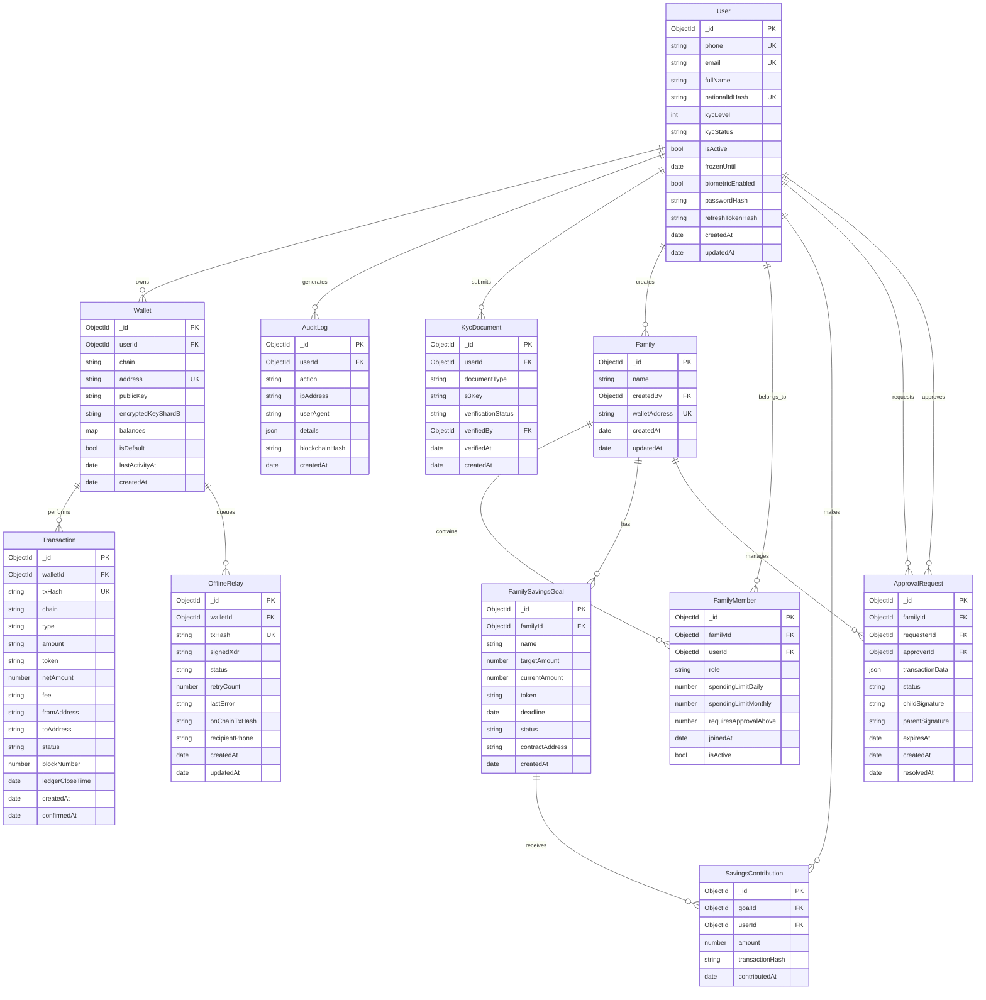

# FastPay MongoDB ERD (Canonical)

All services connect to the same MongoDB database (`FastPay`) and follow these collections.
Schema definitions live in `libs/schemas/`.

## Collection → Service ownership

| Collection | Service |
|------------|---------|
| `users` | auth-service |
| `wallets` | wallet-service |
| `transactions`, `offline_relay` | payment-service |
| `families`, `family_members`, `family_savings_goals`, `savings_contributions`, `approval_requests` | family-service |
| `kyc_documents` | kyc-service |
| `audit_logs` | audit-service |

## External mapping

- `Wallet.address` / `publicKey` maps to **Stellar** on-chain accounts (via blockchain-service).
- `offline_relay` entries promote to `transactions` once broadcast confirms.
